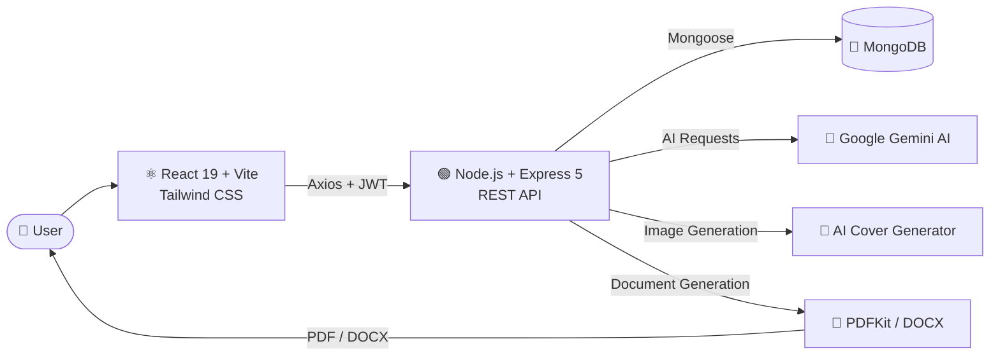

# 📚 eBookAI — AI-Powered eBook Creator & Publishing Platform

<p align="center">
  <strong>Turn your ideas into professionally written and formatted eBooks with AI.</strong>
</p>

<p align="center">
  <a href="https://ebook-ai-sepia.vercel.app/">
    
  </a>
  <a href="https://github.com/BhanuPratap13/ebookAI">
    
  </a>
</p>

<p align="center">
  
  
  
  
  
  
  
</p>

---

## 🌟 Overview

**eBookAI** is a full-stack AI-powered eBook creation and publishing platform designed to transform a simple idea into a complete digital book.

Instead of switching between AI chatbots, markdown editors, image generators, and document converters, users can manage the complete workflow from a single application.

### 💡 The idea

```text
Idea
  ↓
AI-generated Outline
  ↓
AI-generated Chapters
  ↓
Edit & Refine
  ↓
Generate / Upload Cover
  ↓
Preview eBook
  ↓
Export
  ├── PDF
  └── DOCX
```

The platform combines **AI content generation, document editing, cover generation, authentication, persistent storage, and multi-format export** into one unified workflow.

---

## 🚀 Live Demo

### 👉 [Launch eBookAI](https://ebook-ai-sepia.vercel.app/)

> **Note:** Replace the demo URL above with your actual deployed frontend URL.

### 📦 Source Code

[GitHub Repository](https://github.com/BhanuPratap13/ebookAI)

---

## ✨ Key Features

### 🔐 Secure Authentication

* User registration and login
* JWT-based authentication
* Password hashing with bcrypt
* Protected API routes
* Persistent user sessions
* User profile management

---

### 📊 Personal eBook Dashboard

Manage all your books from a centralized dashboard.

* View all created books
* Search books by title or author
* Draft / Published status
* Chapter count
* Word statistics
* Book cover previews
* Quick access to editing and reading

---

### 🤖 AI-Powered Book Generation

Generate book ideas and content using **Google Gemini AI**.

Users can customize:

* Topic
* Number of chapters
* Writing style
* Description
* Target audience
* Chapter content

Supported writing styles include:

```text
Professional
Conversational
Technical
Academic
Creative
```

---

### 🧠 Intelligent Chapter Generation

The AI writing engine generates structured chapter content in Markdown.

Generated content can include:

* Headings
* Subheadings
* Paragraphs
* Lists
* Bold / italic text
* Code blocks
* Structured sections

The generation pipeline also includes retry and fallback handling to improve reliability when AI APIs experience temporary failures.

---

### ✏️ Smart Markdown Editor

A dedicated writing environment allows users to edit generated content before publishing.

Features include:

* Markdown editing
* Live preview
* Word count
* Character count
* Chapter navigation
* Drag-and-drop chapter ordering
* Automatic saving
* Responsive editing experience

### ⏱️ Auto-Save

Modified chapters are automatically saved in the background every **30 seconds**, reducing the risk of losing work.

---

### 🎨 AI Cover Generator

Generate custom book cover artwork based on the book's metadata.

The cover generation workflow can use:

```text
Title
+
Subtitle
+
Author
+
Genre
       ↓
AI Cover Prompt
       ↓
Generated Cover
```

Users can also upload their own cover.

Supported formats:

* JPG
* PNG
* GIF

Maximum upload size:

```text
2 MB
```

---

### 📖 eBook Reader

Users can preview their completed books inside the application before exporting them.

The reader provides a clean reading experience with the generated chapters and book metadata.

---

### 📤 Multi-Format Export

Export completed books into professional document formats.

#### PDF

Generated using:

```text
PDFKit
```

#### Microsoft Word

Generated using:

```text
DOCX
```

Export flow:

```text
Book
 ↓
Chapter Content
 ↓
Markdown Processing
 ↓
Document Builder
 ↓
PDF / DOCX
 ↓
Download
```

---

## 🖼️ Application Preview

> Add your real screenshots in this section.

### Dashboard


### AI Book Generator


### Smart Editor


### AI Cover Generator


### eBook Reader


---

## 🏗️ System Architecture



---

## 🔄 AI Content Generation Workflow

The AI generation pipeline follows a structured workflow rather than directly asking the model to write an entire book.

```text
User Input
    │
    ├── Topic
    ├── Description
    ├── Chapter Count
    └── Writing Style
            │
            ▼
     Prompt Construction
            │
            ▼
      Google Gemini API
            │
            ▼
      Generated Outline
            │
            ▼
     Chapter-by-Chapter
       Generation
            │
            ▼
      Markdown Content
            │
            ▼
       User Editing
            │
            ▼
        Final Book
```

This chapter-based approach allows users to **generate, review, edit, reorder, and refine content** before exporting the final document.

---

## 🛠️ Tech Stack

| Layer             | Technology      | Purpose                                |
| ----------------- | --------------- | -------------------------------------- |
| Frontend          | React 19        | User interface                         |
| Build Tool        | Vite            | Fast development and production builds |
| Styling           | Tailwind CSS v4 | Responsive UI                          |
| Routing           | React Router    | Client-side navigation                 |
| HTTP Client       | Axios           | API communication                      |
| Icons             | Lucide React    | Interface icons                        |
| Notifications     | React Hot Toast | User feedback                          |
| Editor            | Markdown Editor | Content editing                        |
| Backend           | Node.js         | Server runtime                         |
| Framework         | Express 5       | REST API                               |
| Database          | MongoDB         | Data persistence                       |
| ODM               | Mongoose        | Database modeling                      |
| Authentication    | JWT             | Secure authentication                  |
| Password Security | bcryptjs        | Password hashing                       |
| AI                | Google Gemini   | Content generation                     |
| Cover Generation  | Pollinations AI | AI-generated artwork                   |
| PDF               | PDFKit          | PDF generation                         |
| DOCX              | docx            | Word document generation               |
| File Uploads      | Multer          | Image uploads                          |
| Markdown          | Markdown-it     | Markdown processing                    |

---

## 📁 Project Structure

```text
ebookAI/
│
├── backend/
│   │
│   ├── config/
│   │   └── database configuration
│   │
│   ├── controllers/
│   │   ├── authController
│   │   ├── bookController
│   │   ├── aiController
│   │   └── exportController
│   │
│   ├── middlewares/
│   │   ├── authentication
│   │   └── error handling
│   │
│   ├── models/
│   │   ├── User
│   │   └── Book
│   │
│   ├── routes/
│   │   ├── auth
│   │   ├── books
│   │   ├── ai
│   │   └── export
│   │
│   ├── utils/
│   │
│   ├── uploads/
│   │
│   ├── server.js
│   ├── package.json
│   └── .env
│
├── frontend/
│   │
│   └── eBookCreator/
│       ├── src/
│       │   ├── components/
│       │   ├── pages/
│       │   ├── context/
│       │   ├── utils/
│       │   ├── App.jsx
│       │   └── main.jsx
│       │
│       ├── package.json
│       └── vite.config.js
│
├── package.json
└── README.md
```

---

## 🔑 Environment Variables

Create a `.env` file inside the `backend` directory.

```env
PORT=5000

MONGODB_URI=mongodb://localhost:27017/ebookai

JWT_SECRET=your_jwt_secret_key

GOOGLE_GEMINI_API_KEY=your_google_gemini_api_key
```

### ⚠️ Security

Never commit your `.env` file to GitHub.

Add this to `.gitignore`:

```gitignore
.env
node_modules/
uploads/
```

---

## ⚙️ Getting Started

### 1. Clone the repository

```bash
git clone https://github.com/BhanuPratap13/ebookAI.git

cd ebookAI
```

### 2. Install root dependencies

```bash
npm install
```

### 3. Install backend dependencies

```bash
cd backend

npm install
```

### 4. Install frontend dependencies

```bash
cd ../frontend/eBookCreator

npm install
```

### 5. Configure environment variables

Create:

```text
backend/.env
```

and add the required configuration.

### 6. Start the application

From the root directory:

```bash
npm run dev
```

---

## 🌐 Development URLs

| Service  | URL                         |
| -------- | --------------------------- |
| Frontend | `http://localhost:5173`     |
| Backend  | `http://localhost:5000`     |
| API      | `http://localhost:5000/api` |

---

## 📜 Available Scripts

| Command               | Description                      |
| --------------------- | -------------------------------- |
| `npm start`           | Start frontend and backend       |
| `npm run dev`         | Run development environment      |
| `npm run server`      | Start backend                    |
| `npm run client`      | Start frontend                   |
| `npm run install:all` | Install all project dependencies |

---

## 📡 API Documentation

### 🔐 Authentication

| Method | Endpoint             | Description            |
| ------ | -------------------- | ---------------------- |
| POST   | `/api/auth/register` | Register a new user    |
| POST   | `/api/auth/login`    | Login user             |
| GET    | `/api/auth/me`       | Get authenticated user |

---

### 📚 Books

| Method | Endpoint               | Description         |
| ------ | ---------------------- | ------------------- |
| GET    | `/api/books`           | Get user's books    |
| POST   | `/api/books`           | Create a book       |
| GET    | `/api/books/:id`       | Get a specific book |
| PUT    | `/api/books/:id`       | Update a book       |
| PUT    | `/api/books/:id/cover` | Upload book cover   |
| DELETE | `/api/books/:id`       | Delete a book       |

---

### 🤖 AI

| Method | Endpoint                   | Description              |
| ------ | -------------------------- | ------------------------ |
| POST   | `/api/ai/generate-outline` | Generate book outline    |
| POST   | `/api/ai/generate-chapter` | Generate chapter content |
| POST   | `/api/ai/generate-cover`   | Generate AI cover        |

---

### 📤 Export

| Method | Endpoint                   | Description         |
| ------ | -------------------------- | ------------------- |
| GET    | `/api/export/pdf/:bookId`  | Export book as PDF  |
| GET    | `/api/export/docx/:bookId` | Export book as DOCX |

---

## 🔒 Security Considerations

eBookAI implements several security mechanisms:

* JWT-based authentication
* Password hashing using bcrypt
* Protected API routes
* Input validation
* File type validation
* File size restrictions
* Environment-based secret management
* User-specific book access

---

## 🧩 Engineering Highlights

Some of the key engineering challenges addressed in the project include:

### Reliable AI Generation

AI APIs can experience temporary failures or rate limits. The application handles these situations through retry and fallback strategies.

```text
Request
   ↓
Gemini API
   │
   ├── Success → Return Content
   │
   └── Failure
         ↓
     Retry / Backoff
         ↓
     Fallback Model
         ↓
     Return Response
```

### Persistent Editing

The editor periodically saves modified content so users don't need to manually save after every change.

### Document Generation

The backend converts stored chapter content into downloadable PDF and DOCX documents.

### Separation of Concerns

The backend follows a modular structure separating:

```text
Routes
 ↓
Controllers
 ↓
Models
 ↓
Utilities
```

## 📄 License

This project is licensed under the **ISC License**.

---

<p align="center">
  Built with ❤️ using React, Node.js, MongoDB and Google Gemini AI.
</p>

<p align="center">
  ⭐ If you found this project useful, consider giving it a star!
</p>
